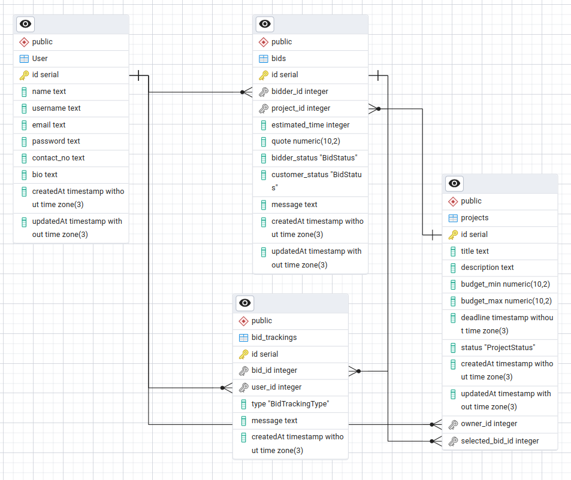

# Freelance Project Bidding Platform

A full-stack freelance marketplace where buyers can post projects and sellers (freelancers) can place bids. Once a bid is selected, both parties can communicate and track project progress through a status system with support for messaging and file uploads.

---

## ✨ Key Features

### 📝 Project Creation (Buyer)
- Buyers can create new projects with:
  - Title
  - Description
  - Budget Range
  - Deadline
- Stored in PostgreSQL using Prisma ORM.

### 📤 Bidding (Seller)
- Sellers can:
  - View open/public projects
  - Submit bids including:
    - Seller’s name
    - Bid amount
    - Estimated completion time
    - A brief message
- Bids are stored and associated with the respective project.

### ✅ Bid Selection & Project Status
- Buyers can:
  - View all bids on their own project
  - Select a seller (bidder)
- Once selected:
  - Project status updates to `In Progress`
  - Email notification sent to the selected seller using **Nodemailer**

### 📈 Status Tracking
- Projects go through the following statuses:
  - `Pending`, `In Progress`, `Completed`
- All status changes (for projects and bids) are recorded in the database.

### 📦 Project Delivery
- Sellers can upload deliverables after marking the project complete.
- Buyers review and approve the delivery.
- On approval:
  - Status updates to `Completed`
  - Emails are sent to both buyer and seller

### 💬 Messaging System
- Once a bid is selected:
  - Owner and bidder can message each other
  - All messages and updates are tracked in the `bid_trackings` table

---

## 🔐 Security & Authorization

- JWT-based authentication
- Tokens are stored in cookies for security
- Backend authorization middleware ensures:
  - Only owners can view their project’s bids
  - Only related users (owner or bidder) can view or update a bid or project

---

## 🖼️ Entity Relationship (ER) Diagram

---

## 💻 Tech Stack

| Layer      | Technology                |
|------------|---------------------------|
| Frontend   | Next.js, TailwindCSS, Shadcn |
| Backend    | Node.js (Express v5), TypeScript, express-generator-typescript |
| ORM        | Prisma                    |
| Database   | PostgreSQL                |
| Auth       | JWT + BcryptJS            |
| Email      | Nodemailer                |
| Deployment | Frontend - Vercel  
| Backend    | Render                    |

---

## 🌐 Pages Overview

- **Public**:
  - Project list
  - Project detail
- **Private**:
  - Bid submission
  - Bid visibility (only owner can view bids)
  - Bid/project status updates (by respective user)
  - Messaging between selected bidder and owner

---

## 🛠 Developer Notes

- Implemented shared API utility for both server-side and client-side requests
- Project and bid ownership is enforced via middleware
- Used Prisma for schema modeling and database access
- Optimized for clean code and maintainability

---

## 📦 Installation & Setup

### Backend

1. check the .md file in the Backend directory
2. `mkdir -p config && touch config/.env.production && yarn install --production=false && yarn migrate && yarn build`
3. 
